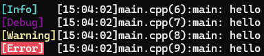

# Log System
Log system write in C++ (console & file)

## Table of Content
- [Add to your project](#add-to-your-project)
- [Functionnality](#functionnality)
- [Requirement](#requirement)
- [Credit](#credit)

## Add to your project
```bash
$git submodule add git@github.com:Vincent-Devine/Log_System.git
```

Include ```Log.hpp``` in your files.

## Functionnality
### Write log on file
```cpp
#include "Log.hpp"

// Start of your program
Log::OpenFile("log.txt");

// ...

// End of your program
Log::CloseFile();
```

### Logging
Call macro ```LOG_INFO```, ```LOG_DEBUG```, ```LOG_WARNING``` or ```LOG_ERROR``` to write your log to the console and your file (if you've opened it before).<br>
The log message is preceded by the log level, the time, the file, the line and the function in which th log was called.
```cpp
#include "Log.hpp"

int main()
{
    LOG_INFO("hello");
    LOG_DEBUG("hello");
    LOG_WARNING("hello");
    LOG_ERROR("hello");
    // ...
}
```

Result: <br>


### Assertion
```cpp
#include "Log.hpp"

Assertion(true, "gg, true == true");
```

## Requirement
- C++ 20
- Windows system

## Credit
Vincent DEVINE